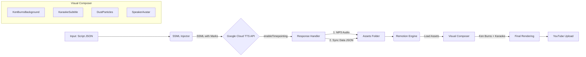

# Design Document: High-Retention Video Generator

## Overview

유튜브 수익 창출 제재를 회피하고 시청 지속 시간을 극대화하기 위한 고품질 자동화 어학 영상 생성 시스템. 기존 `src/tts/google.ts` 모듈을 확장하여 SSML Mark 기반 타임포인트 추출을 추가하고, 새로운 Remotion 컴포넌트들을 통해 노래방 자막, Ken Burns 효과, 화자 연출 등을 구현한다.

## Architecture



## Components and Interfaces

### 1. SSML Injector (`src/tts/ssml-injector.ts`)

스크립트 텍스트를 SSML Mark가 삽입된 형태로 변환하는 모듈.

```typescript
interface SSMLInjectorInput {
  text: string; // 원본 텍스트
  sentenceId: number; // 문장 ID (마크 네이밍용)
}

interface SSMLInjectorOutput {
  ssml: string; // <speak>...</speak> 형태의 SSML
  wordMap: WordMapEntry[]; // 마크 ID와 원본 단어 매핑
}

interface WordMapEntry {
  markName: string; // "index_0", "index_1", ...
  word: string; // 원본 단어 (문장부호 포함)
  index: number; // 단어 순서
}

function injectSSMLMarks(input: SSMLInjectorInput): SSMLInjectorOutput;
```

**구현 로직:**

1. 정규식으로 단어 토큰화: `/(\S+)/g` (공백이 아닌 연속 문자)
2. 각 단어 앞에 `<mark name="index_N"/>` 삽입
3. 문장부호는 앞 단어에 붙여서 처리 (별도 마크 생성 안 함)
4. `<speak>` 태그로 감싸서 반환

### 2. Google TTS with Timepoints (`src/tts/google-timepoint.ts`)

기존 `google.ts`를 확장하여 타임포인트 추출 기능 추가.

```typescript
interface TimepointTTSRequest {
  ssml: string;
  languageCode: string;
  voiceName: string;
  gender: 'MALE' | 'FEMALE';
  speakingRate: number;
  pitch?: number; // 화자별 피치 조절용
}

interface TimepointTTSResponse {
  audioBuffer: Buffer;
  timepoints: Timepoint[];
}

interface Timepoint {
  markName: string; // "index_0"
  timeSeconds: number; // 0.52
}

interface ScriptSyncData {
  sentenceId: number;
  text: string;
  audioFile: string;
  words: WordSync[];
}

interface WordSync {
  word: string;
  start: number; // startInSeconds
  end: number; // endInSeconds (다음 단어 시작 또는 오디오 끝)
}

async function synthesizeWithTimepoints(
  request: TimepointTTSRequest
): Promise<TimepointTTSResponse>;

function buildSyncData(
  wordMap: WordMapEntry[],
  timepoints: Timepoint[],
  audioDuration: number,
  sentenceId: number,
  text: string,
  audioFile: string
): ScriptSyncData;
```

**API 호출 변경점:**

```typescript
const request = {
  input: { ssml },
  voice: { languageCode, name: voiceName, ssmlGender: gender },
  audioConfig: {
    audioEncoding: 'MP3',
    speakingRate,
    pitch, // -20.0 ~ 20.0
  },
  enableTimePointing: ['SSML_MARK'], // 핵심 옵션
};
```

### 3. Karaoke Subtitle Component (`src/components/KaraokeSubtitle.tsx`)

음성에 맞춰 단어가 하이라이트되는 자막 컴포넌트. 기존 Step 1,2,3,4 구조와 호환되도록 설계.

```typescript
interface KaraokeSubtitleProps {
  words: WordSync[];
  mode: 'karaoke' | 'blank'; // karaoke: 단어 하이라이트, blank: 빈칸으로 표시
  activeColor: string; // 활성 단어 색상 (e.g., '#FFD700')
  inactiveColor: string; // 비활성 단어 색상 (e.g., '#FFFFFF')
  inactiveOpacity: number; // 비활성 투명도 (0.5)
  fontSize: number;
  fontFamily: string;
  transitionDuration: number; // CSS transition (0.1)
  blankChar?: string; // 빈칸 문자 (default: '_')
}

const KaraokeSubtitle: React.FC<KaraokeSubtitleProps>;
```

**기존 Step 구조와의 통합:**

| Step   | 현재 동작          | Karaoke 통합 후                                       |
| ------ | ------------------ | ----------------------------------------------------- |
| Step 1 | 자막 없이 오디오만 | `mode: 'blank'` - 빈칸이 타이밍에 맞춰 순차 등장      |
| Step 2 | 전체 자막 표시     | `mode: 'karaoke'` - 단어가 말하는 타이밍에 하이라이트 |
| Step 3 | 빈칸/정답 자막     | `mode: 'karaoke'` - 단어가 말하는 타이밍에 하이라이트 |
| Step 4 | 자막 없이 오디오만 | `mode: 'blank'` - 빈칸이 타이밍에 맞춰 순차 등장      |

**렌더링 로직:**

```typescript
const frame = useCurrentFrame();
const { fps } = useVideoConfig();
const currentTime = frame / fps;

// 각 단어별 활성 상태 계산
const isActive = (word: WordSync) => currentTime >= word.start && currentTime < word.end;
const isPast = (word: WordSync) => currentTime >= word.end;

// mode에 따른 렌더링
if (mode === 'blank') {
  // 빈칸 모드: 아직 재생 안 된 단어는 숨김, 재생된 단어는 빈칸으로 표시
  return words.map((word) => (isPast(word) || isActive(word) ? '___' : ''));
} else {
  // 카라오케 모드: 활성 단어 하이라이트
  return words.map((word) => ({
    text: word.word,
    isActive: isActive(word),
    isPast: isPast(word),
  }));
}
```

### 4. Ken Burns Background (`src/components/KenBurnsBackground.tsx`)

정지 이미지에 동적 효과를 적용하는 배경 컴포넌트.

```typescript
interface KenBurnsPattern {
  type: 'zoom-in' | 'zoom-out' | 'pan-left' | 'pan-right' | 'diagonal';
  startScale: number; // 1.0
  endScale: number; // 1.15
  startX: number; // 0 (center)
  endX: number; // 50 (pixels)
  startY: number;
  endY: number;
  easing: 'spring' | 'ease-in-out' | 'linear';
}

interface KenBurnsBackgroundProps {
  src: string; // 이미지 경로
  patterns: KenBurnsPattern[];
  intervalFrames: number; // 패턴 전환 간격 (5~10초 * fps)
  width: number;
  height: number;
}

const KenBurnsBackground: React.FC<KenBurnsBackgroundProps>;
```

**패턴 프리셋:**

```typescript
const KEN_BURNS_PRESETS: Record<string, KenBurnsPattern> = {
  'zoom-in-center': {
    type: 'zoom-in',
    startScale: 1.0,
    endScale: 1.15,
    startX: 0,
    endX: 0,
    startY: 0,
    endY: 0,
    easing: 'ease-in-out',
  },
  'pan-left-zoom': {
    type: 'diagonal',
    startScale: 1.0,
    endScale: 1.1,
    startX: 30,
    endX: -30,
    startY: 0,
    endY: 0,
    easing: 'ease-in-out',
  },
  // ... 더 많은 프리셋
};
```

### 5. Speaker Avatar Component (`src/components/SpeakerAvatar.tsx`)

화자 아바타를 표시하고 전환 애니메이션을 적용하는 컴포넌트.

```typescript
interface Speaker {
  id: 'A' | 'B';
  name: string;
  avatarSrc: string;
  pitch: number; // TTS 피치 조절값
}

interface SpeakerAvatarProps {
  speakers: [Speaker, Speaker];
  activeSpeaker: 'A' | 'B' | null;
  mode: 'dialogue' | 'narrator';
  position: 'left' | 'right' | 'center';
  activeScale: number; // 1.2
  inactiveScale: number; // 1.0
  activeBrightness: number; // 1.0
  inactiveBrightness: number; // 0.6
  transitionDuration: number; // 0.3s
}

const SpeakerAvatar: React.FC<SpeakerAvatarProps>;
```

### 6. Dust Particles Overlay (`src/components/DustParticles.tsx`)

화면에 미세한 파티클 효과를 추가하는 오버레이 컴포넌트.

```typescript
interface DustParticlesProps {
  particleCount: number; // 파티클 개수
  opacity: number; // 전체 투명도
  speed: number; // 이동 속도 배율
  color: string; // 파티클 색상
  size: { min: number; max: number }; // 크기 범위
}

const DustParticles: React.FC<DustParticlesProps>;
```

### 7. Visual Composer (`src/compositions/HighRetentionVideo.tsx`)

모든 컴포넌트를 조합하여 최종 영상을 구성하는 메인 컴포지션.

```typescript
interface HighRetentionVideoProps {
  syncData: ScriptSyncData[];
  backgroundSrc: string;
  mode: 'dialogue' | 'narrator';
  speakers?: [Speaker, Speaker];
  config: VisualConfig;
}

interface VisualConfig {
  karaoke: {
    activeColor: string;
    inactiveColor: string;
    fontSize: number;
  };
  kenBurns: {
    enabled: boolean;
    patterns: string[]; // 프리셋 이름들
    intervalSeconds: number;
  };
  dust: {
    enabled: boolean;
    particleCount: number;
    opacity: number;
  };
  speaker: {
    activeScale: number;
    transitionDuration: number;
  };
}
```

## Data Models

### Script Sync Data Schema (Zod)

```typescript
import { z } from 'zod';

const wordSyncSchema = z.object({
  word: z.string(),
  start: z.number().min(0),
  end: z.number().min(0),
});

const scriptSyncDataSchema = z.object({
  sentenceId: z.number().int().positive(),
  text: z.string(),
  audioFile: z.string(),
  speaker: z.enum(['A', 'B']).optional(),
  words: z.array(wordSyncSchema),
});

const syncManifestSchema = z.object({
  sentences: z.array(scriptSyncDataSchema),
  totalDuration: z.number(),
  mode: z.enum(['dialogue', 'narrator']),
});
```

### Channel Config Extension

기존 `channelConfigSchema`에 추가할 필드:

```typescript
const karaokeConfigSchema = z.object({
  activeColor: z.string().default('#FFD700'),
  inactiveColor: z.string().default('#FFFFFF'),
  inactiveOpacity: z.number().min(0).max(1).default(0.5),
  fontSize: z.number().default(48),
  transitionDuration: z.number().default(0.1),
});

const kenBurnsConfigSchema = z.object({
  enabled: z.boolean().default(true),
  patterns: z.array(z.string()).default(['zoom-in-center', 'pan-left-zoom']),
  intervalSeconds: z.number().min(3).max(15).default(7),
  zoomRange: z.object({
    min: z.number().default(1.0),
    max: z.number().default(1.15),
  }),
});

const dustConfigSchema = z.object({
  enabled: z.boolean().default(true),
  particleCount: z.number().default(50),
  opacity: z.number().min(0).max(1).default(0.3),
  speed: z.number().default(1.0),
});

const speakerConfigSchema = z.object({
  mode: z.enum(['dialogue', 'narrator']).default('narrator'),
  speakers: z
    .array(
      z.object({
        id: z.enum(['A', 'B']),
        name: z.string(),
        avatarSrc: z.string(),
        pitch: z.number().min(-20).max(20).default(0),
      })
    )
    .optional(),
  activeScale: z.number().default(1.2),
  transitionDuration: z.number().default(0.3),
});

// 채널 설정에 추가
const highRetentionConfigSchema = z.object({
  karaoke: karaokeConfigSchema.optional(),
  kenBurns: kenBurnsConfigSchema.optional(),
  dust: dustConfigSchema.optional(),
  speaker: speakerConfigSchema.optional(),
});
```

## Correctness Properties

_A property is a characteristic or behavior that should hold true across all valid executions of a system—essentially, a formal statement about what the system should do. Properties serve as the bridge between human-readable specifications and machine-verifiable correctness guarantees._

### Property 1: SSML Injection Preserves Words

_For any_ valid text input containing N words, the SSML Injector SHALL produce output where:

- The wordMap contains exactly N entries
- Each entry's word matches the original word (including attached punctuation)
- Mark IDs are sequential (index_0, index_1, ..., index_N-1)
- The SSML output is wrapped in `<speak>` tags

**Validates: Requirements 1.1, 1.2, 1.3, 1.5, 1.7**

### Property 2: Sync Data Timing Consistency

_For any_ list of timepoints with N entries, the generated ScriptSyncData SHALL satisfy:

- words[i].end === words[i+1].start for all i < N-1
- words[N-1].end equals the total audio duration
- All start times are non-negative and monotonically increasing

**Validates: Requirements 2.3, 2.4**

### Property 3: Word Active State Calculation

_For any_ word with start time S and end time E, and _for any_ current time T:

- isActive(word, T) === true if and only if S <= T < E
- Exactly one word should be active at any given time within the sentence duration

**Validates: Requirements 3.2**

### Property 4: Ken Burns Pattern Cycling

_For any_ video with duration D seconds and interval I seconds:

- The number of pattern transitions should be approximately D / I
- Scale values should always be within configured range [minScale, maxScale]
- Consecutive patterns should be different (no immediate repetition)

**Validates: Requirements 4.1, 4.2, 4.5**

### Property 5: Z-Index Layer Ordering

_For any_ composition with multiple overlay layers:

- Background layer has lowest z-index
- Dust particles layer is above background
- Subtitle layer is above dust particles
- Speaker avatar layer is above subtitles
- All z-index values are unique and properly ordered

**Validates: Requirements 5.5**

### Property 6: Pipeline Error Resilience

_For any_ batch of N scripts where M scripts are invalid:

- The pipeline should reject M scripts with specific error messages
- The pipeline should successfully process N-M valid scripts
- Failed scripts should not prevent processing of subsequent scripts

**Validates: Requirements 6.3, 6.6**

### Property 7: Batch Processing Variety

_For any_ batch of N scripts processed sequentially:

- N output videos should be generated
- Intro elements (music, hook text) should vary between consecutive videos
- No two consecutive videos should have identical intro sequences

**Validates: Requirements 6.5, 6.9**

### Property 8: Config Merge Completeness

_For any_ channel config C and global defaults D:

- merge(C, D) should contain all fields from D
- Fields present in C should override corresponding fields in D
- The merged result should pass Zod schema validation
- Invalid configs should produce errors with specific field paths

**Validates: Requirements 7.5, 7.6, 7.7**

### Property 9: Speaker State Consistency

_For any_ dialogue with speaker turns, when speaker X is active:

- Speaker X's avatar scale should equal activeScale
- Speaker X's avatar brightness should equal activeBrightness
- Other speaker's avatar scale should equal inactiveScale
- Subtitle alignment should match speaker position (A=left, B=right)

**Validates: Requirements 8.2, 8.3, 8.4**

### Property 10: Narrator Mode Visual Triggers

_For any_ narrator mode script:

- Keywords matching configured regex patterns should trigger popup animations
- Numbers/statistics should trigger infographic animations
- Background transitions should occur at configured intervals
- Consecutive transitions should use different effects

**Validates: Requirements 9.2, 9.3, 9.4, 9.7**

## Error Handling

### SSML Injector Errors

| Error Type            | Condition                                | Handling                                         |
| --------------------- | ---------------------------------------- | ------------------------------------------------ |
| EmptyTextError        | Input text is empty or whitespace only   | Return error with message "Text cannot be empty" |
| InvalidCharacterError | Text contains characters that break SSML | Escape or normalize characters before processing |

### TTS API Errors

| Error Type                | Condition                                   | Handling                                            |
| ------------------------- | ------------------------------------------- | --------------------------------------------------- |
| AuthenticationError       | Invalid or expired access token             | Retry with refreshed token, max 3 attempts          |
| QuotaExceededError        | API quota limit reached                     | Log error, skip to next script in batch             |
| TimeoutError              | API response takes > 30 seconds             | Retry with exponential backoff, max 3 attempts      |
| IncompleteTimepointsError | Timepoints array is shorter than word count | Estimate missing timestamps based on audio duration |

### Rendering Errors

| Error Type           | Condition                           | Handling                                |
| -------------------- | ----------------------------------- | --------------------------------------- |
| MissingAssetError    | Required audio/image file not found | Log error with file path, skip script   |
| InvalidSyncDataError | Sync data fails schema validation   | Log validation errors, skip script      |
| RenderTimeoutError   | Remotion render exceeds timeout     | Log error, attempt with reduced quality |

## Testing Strategy

### Unit Tests

Unit tests should cover:

- SSML Injector tokenization edge cases (punctuation, numbers, special characters)
- Sync data calculation with various timepoint configurations
- Config merge logic with partial overrides
- Word active state calculation at boundary conditions

### Property-Based Tests

Property-based tests using `fast-check` library:

- Minimum 100 iterations per property
- Each test tagged with: **Feature: high-retention-video-generator, Property N: [property_text]**

**Test Configuration:**

```typescript
import fc from 'fast-check';

// Property 1: SSML Injection
fc.assert(
  fc.property(fc.array(fc.string({ minLength: 1 }), { minLength: 1, maxLength: 50 }), (words) => {
    const text = words.join(' ');
    const result = injectSSMLMarks({ text, sentenceId: 1 });
    return (
      result.wordMap.length === words.length &&
      result.ssml.startsWith('<speak>') &&
      result.ssml.endsWith('</speak>')
    );
  }),
  { numRuns: 100 }
);
```

### Integration Tests

- End-to-end pipeline test with sample script
- Remotion composition rendering test
- Config loading and validation test
