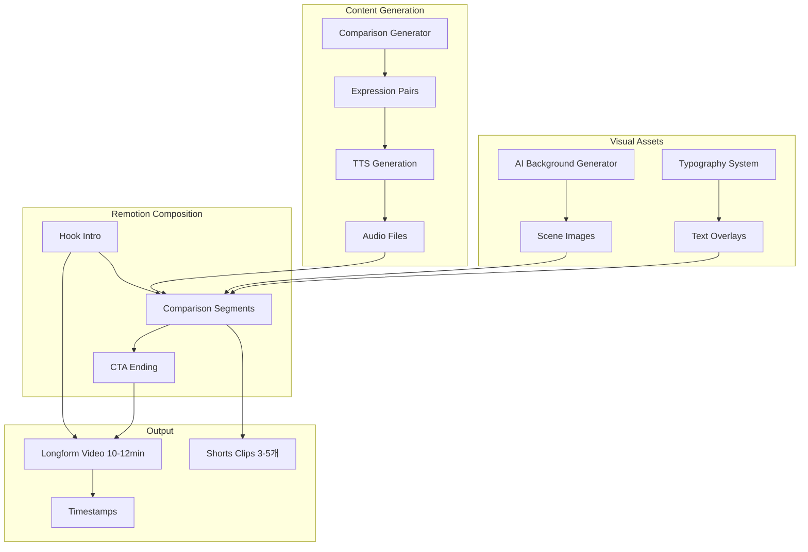

# Design Document: Korean vs Native Longform Video Generator

## Overview

"한국인 영어 vs 원어민 영어" 비교형 롱폼 콘텐츠 자동 생성 시스템. 기존 Remotion 파이프라인과 AI 이미지 생성(Imagen)을 활용하여 10-12분 길이의 고품질 영상을 자동 생성한다.

핵심 원칙:

- 10초마다 새로운 정보 제공 → 이탈 방지
- 시청자가 "판단"만 하게 함 → 참여도 향상
- "나도 이렇게 말했는데?" 공감 유발 → 댓글/공유 증가
- 고퀄리티 비주얼 (AI 생성 배경 + 깔끔한 타이포그래피)

## Architecture



## Components and Interfaces

### 1. Content Types (`src/comparison/types.ts`)

```typescript
import { z } from 'zod';

// 비교 세그먼트 스키마
export const comparisonSegmentSchema = z.object({
  id: z.number(),
  category: z.enum(['daily', 'business', 'emotion', 'request_reject', 'apology_thanks']),
  situation: z.string().min(1), // 상황 설명 (한국어)
  koreanExpression: z.object({
    text: z.string().min(1), // 한국인이 흔히 쓰는 표현
    literal: z.string().optional(), // 직역 (선택)
  }),
  nativeExpression: z.object({
    text: z.string().min(1), // 원어민 표현
    note: z.string().optional(), // 뉘앙스 설명 (선택)
  }),
  explanation: z.string().min(1), // 왜 다른지 간단 설명
});

// 비교 스크립트 스키마
export const comparisonScriptSchema = z.object({
  channelId: z.string(),
  date: z.string(),
  title: z.object({
    korean: z.string(), // "한국인 vs 원어민 일상편 #1"
    english: z.string(), // "Korean vs Native - Daily #1"
  }),
  hook: z.object({
    text: z.string(), // "90%가 틀리는 영어"
    subtext: z.string().optional(), // "당신도 이렇게 말하고 있을지도..."
  }),
  segments: z.array(comparisonSegmentSchema).min(25).max(35),
  cta: z.object({
    question: z.string(), // "몇 개나 알고 계셨나요?"
    reminder: z.string(), // "구독과 좋아요 부탁드려요"
  }),
});

export type ComparisonSegment = z.infer<typeof comparisonSegmentSchema>;
export type ComparisonScript = z.infer<typeof comparisonScriptSchema>;
export type ComparisonCategory = ComparisonSegment['category'];

// 카테고리 한글명
export const CATEGORY_NAMES: Record<ComparisonCategory, string> = {
  daily: '일상',
  business: '비즈니스',
  emotion: '감정표현',
  request_reject: '요청/거절',
  apology_thanks: '사과/감사',
};
```

### 2. Comparison Generator (`src/comparison/generator.ts`)

```typescript
interface ComparisonGeneratorConfig {
  segmentCount: number; // 25-35
  categories: ComparisonCategory[]; // 포함할 카테고리
  excludeExpressions?: string[]; // 제외할 표현 (중복 방지)
}

class ComparisonGenerator {
  private genAI: GoogleGenerativeAI;

  constructor(apiKey: string);

  // 비교 스크립트 전체 생성
  async generateScript(
    channelId: string,
    config: ComparisonGeneratorConfig
  ): Promise<ComparisonScript>;

  // Hook 텍스트 생성 (다양성 보장)
  generateHook(): { text: string; subtext: string };

  // CTA 텍스트 생성
  generateCTA(): { question: string; reminder: string };
}
```

**Gemini 프롬프트 예시:**

```typescript
const COMPARISON_PROMPT = `
You are an expert English teacher creating "Korean English vs Native English" comparison content.

Generate ${count} comparison pairs for a YouTube video.

Each pair should have:
1. situation: 상황 설명 (Korean, 1-2 sentences)
2. koreanExpression: 한국인이 흔히 쓰는 영어 (awkward but understandable)
3. nativeExpression: 원어민이 실제로 쓰는 표현 (natural, commonly used)
4. explanation: 왜 다른지 간단 설명 (Korean, 1 sentence)

Categories to include: ${categories.join(', ')}

IMPORTANT RULES:
- Korean expressions should be things Koreans ACTUALLY say (common mistakes)
- Native expressions should be what Americans/British ACTUALLY say
- Focus on expressions that make viewers think "나도 이렇게 말했는데!"
- Avoid textbook examples, use real conversational English
- Each pair should be self-contained (understandable without context)

Examples of GOOD pairs:
❌ "I'm sorry, I can't." → ⭕ "I wish I could, but..."
❌ "Fighting!" → ⭕ "You got this!" / "Go for it!"
❌ "I will go to home." → ⭕ "I'm heading home."

Return JSON array with this structure:
[
  {
    "category": "daily",
    "situation": "친구가 도움을 요청했는데 거절해야 할 때",
    "koreanExpression": { "text": "I'm sorry, I can't." },
    "nativeExpression": { "text": "I wish I could, but I'm swamped right now." },
    "explanation": "단순 거절보다 아쉬움을 표현하면 더 자연스럽고 예의 바름"
  }
]
`;
```

### 3. Visual Components

#### ComparisonView (`src/compositions/ComparisonView.tsx`)

```typescript
interface ComparisonViewProps {
  segment: ComparisonSegment;
  phase: 'situation' | 'korean' | 'native' | 'explanation';
  style: {
    backgroundColor: string;
    koreanColor: string; // 빨간색 계열
    nativeColor: string; // 초록색 계열
    textColor: string;
    fontSize: number;
  };
}

// 렌더링 순서:
// 1. situation (2초) - 상황 설명
// 2. korean (3초) - ❌ 한국인 표현
// 3. native (3초) - ⭕ 원어민 표현
// 4. explanation (2초) - 설명
// Total: ~10초 per segment
```

#### HookIntro (`src/compositions/HookIntro.tsx`)

```typescript
interface HookIntroProps {
  text: string; // "90%가 틀리는 영어"
  subtext?: string; // "당신도 이렇게 말하고 있을지도..."
  duration: number; // 프레임 수 (약 5초)
  style: {
    backgroundColor: string;
    textColor: string;
    accentColor: string;
    animation: 'fade' | 'zoom' | 'slide';
  };
}
```

#### CTAEnding (`src/compositions/CTAEnding.tsx`)

```typescript
interface CTAEndingProps {
  question: string; // "몇 개나 알고 계셨나요?"
  reminder: string; // "구독과 좋아요 부탁드려요"
  duration: number; // 프레임 수 (약 10-15초)
  channelLogo?: string;
}
```

### 4. Main Composition (`src/compositions/ComparisonLongform.tsx`)

```typescript
interface ComparisonLongformProps {
  script: ComparisonScript;
  audioFiles: AudioFile[];
  backgroundImage: string;
  config: {
    fps: number; // 30
    width: number; // 1920
    height: number; // 1080
    segmentDuration: number; // 프레임 (약 10초 = 300프레임)
    transitionDuration: number; // 프레임 (약 0.5초 = 15프레임)
  };
}

// 영상 구조:
// [0:00-0:05] Hook Intro
// [0:05-0:20] 첫 번째 비교 (situation → korean → native → explanation)
// [0:20-0:35] 두 번째 비교
// ...
// [9:30-9:45] 마지막 비교
// [9:45-10:00] CTA Ending
```

### 5. Audio Generation

기존 TTS 시스템 활용:

```typescript
interface ComparisonAudioConfig {
  situationVoice: string; // 한국어 TTS (상황 설명)
  koreanVoice: string; // 영어 TTS (한국식 발음 느낌)
  nativeVoice: string; // 영어 TTS (원어민 발음)
  explanationVoice: string; // 한국어 TTS (설명)
}

// 각 세그먼트별 오디오 파일 생성:
// - {id}_situation.mp3
// - {id}_korean.mp3
// - {id}_native.mp3
// - {id}_explanation.mp3
```

### 6. Expression Database (`src/comparison/expression-db.ts`)

```typescript
interface ExpressionRecord {
  expression: string;
  category: ComparisonCategory;
  videoId: string;
  usedAt: string;
}

interface ExpressionDatabase {
  // 표현 추가
  addExpression(record: ExpressionRecord): Promise<void>;

  // 최근 N개 비디오에서 사용된 표현 조회
  getRecentExpressions(videoCount: number): Promise<string[]>;

  // 블랙리스트 관리
  addToBlacklist(expression: string): Promise<void>;
  isBlacklisted(expression: string): Promise<boolean>;
}

// JSON 파일 기반 구현 (output/{channelId}/expression-db.json)
```

### 7. Pipeline (`src/comparison/pipeline.ts`)

```typescript
interface ComparisonPipelineOptions {
  channelId: string;
  segmentCount?: number; // default: 30
  categories?: ComparisonCategory[];
  outputDir?: string;
  autoRender?: boolean;
  extractShorts?: boolean;
}

interface ComparisonPipelineResult {
  success: boolean;
  script: ComparisonScript;
  audioFiles: AudioFile[];
  videoPath?: string;
  shortsClips?: string[];
  timestamps: string;
}

async function runComparisonPipeline(
  options: ComparisonPipelineOptions
): Promise<ComparisonPipelineResult>;
```

## Data Models

### Video Structure

```
[Hook Intro: 5초]
├── 메인 텍스트: "90%가 틀리는 영어"
├── 서브 텍스트: "당신도 이렇게 말하고 있을지도..."
└── 애니메이션: fade-in + scale

[Segment 1-30: 각 10초, 총 5분]
├── Phase 1 (2초): 상황 설명
├── Phase 2 (3초): ❌ 한국인 표현
├── Phase 3 (3초): ⭕ 원어민 표현
└── Phase 4 (2초): 설명

[Transition: 각 0.5초]
└── fade or slide

[CTA Ending: 15초]
├── 질문: "몇 개나 알고 계셨나요?"
├── 구독 유도
└── 채널 로고
```

### Timing Calculation

```typescript
const TIMING = {
  hookDuration: 5 * 30, // 150 frames (5초)
  segmentDuration: 10 * 30, // 300 frames (10초)
  transitionDuration: 0.5 * 30, // 15 frames (0.5초)
  ctaDuration: 15 * 30, // 450 frames (15초)
};

// 30 segments 기준:
// Hook: 5초
// Segments: 30 * 10초 = 300초 (5분)
// Transitions: 29 * 0.5초 = 14.5초
// CTA: 15초
// Total: 약 5분 35초

// 목표 10-12분을 위해 segment 수 조절 또는 segment 길이 조절
```

## Correctness Properties

_A property is a characteristic or behavior that should hold true across all valid executions of a system—essentially, a formal statement about what the system should do._

### Property 1: Segment Count Bounds

_For any_ generated ComparisonScript, the segments array length SHALL be between 25 and 35 inclusive.

**Validates: Requirements 1.1**

### Property 2: Segment Structure Completeness

_For any_ ComparisonSegment, it SHALL contain non-empty values for: situation, koreanExpression.text, nativeExpression.text, and explanation.

**Validates: Requirements 1.2**

### Property 3: Category Distribution

_For any_ batch of N segments where N >= 10, no single category SHALL represent more than 50% of total segments.

**Validates: Requirements 1.6**

### Property 4: Hook Duration Bounds

_For any_ HookIntro, the duration SHALL be between 3 and 10 seconds.

**Validates: Requirements 2.1**

### Property 5: Expression Uniqueness in Batch

_For any_ generated ComparisonScript, all koreanExpression.text values SHALL be unique within the script.

**Validates: Requirements 8.6**

### Property 6: Expression Recency Check

_For any_ newly generated expression, it SHALL NOT appear in expressions used in the last 10 videos (when database is available).

**Validates: Requirements 8.2**

### Property 7: Video Duration Bounds

_For any_ rendered ComparisonLongform video, total duration SHALL be between 8 and 12 minutes.

**Validates: Requirements 9.4, 9.5**

### Property 8: CTA Duration Bounds

_For any_ CTAEnding, duration SHALL be between 10 and 15 seconds.

**Validates: Requirements 6.5**

### Property 9: Timestamp Generation

_For any_ generated video, timestamps SHALL be produced in YouTube chapter format (MM:SS Label).

**Validates: Requirements 9.6**

### Property 10: Shorts Extraction Count

_For any_ longform video with shorts extraction enabled, the extractor SHALL produce between 3 and 5 clips.

**Validates: Requirements 7.1**

## Error Handling

| Error Type                | Condition                    | Handling                         |
| ------------------------- | ---------------------------- | -------------------------------- |
| InsufficientSegmentsError | Generated < 25 segments      | Regenerate with explicit count   |
| DuplicateExpressionError  | Expression in recent history | Regenerate with exclusion list   |
| DurationOutOfBoundsError  | Video < 8min or > 12min      | Adjust segment count             |
| TTSGenerationError        | TTS API failure              | Retry 3 times, then skip segment |
| RenderTimeoutError        | Remotion timeout             | Reduce quality, retry            |

## Testing Strategy

### Unit Tests

- Segment schema validation
- Category distribution calculation
- Duration calculation
- Expression database CRUD

### Property-Based Tests (fast-check)

```typescript
// Property 1: Segment Count
fc.assert(
  fc.property(fc.integer({ min: 25, max: 35 }), (count) => {
    const script = generator.generateScript({ segmentCount: count });
    return script.segments.length >= 25 && script.segments.length <= 35;
  }),
  { numRuns: 100 }
);

// Property 5: Expression Uniqueness
fc.assert(
  fc.property(fc.integer({ min: 25, max: 35 }), async (count) => {
    const script = await generator.generateScript({ segmentCount: count });
    const expressions = script.segments.map((s) => s.koreanExpression.text);
    return new Set(expressions).size === expressions.length;
  }),
  { numRuns: 100 }
);
```

### Integration Tests

- Full pipeline execution with mock TTS
- Remotion composition rendering
- Shorts extraction from longform
