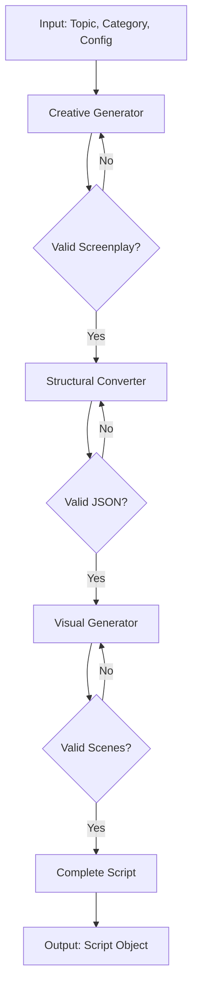

# Design Document: Multi-Step Script Pipeline

## Overview

The Multi-Step Script Pipeline addresses cognitive overload in AI script generation by separating concerns into three distinct phases. Instead of asking the AI to simultaneously write creative content, format JSON, count words, and generate quiz elements, each phase focuses on a single responsibility.

**Current Problem:**

- Single-shot generation asks AI to do too many things at once
- Results in generic stories, broken JSON, and poor educational quality
- AI struggles to balance creativity with structural constraints

**Solution Architecture:**

```
Topic + Category
      │
      ▼
┌─────────────────────┐
│  Creative Phase     │  "Be a Netflix writer"
│  (Free-form script) │  Focus: Story, emotion, engagement
└─────────────────────┘
      │
      ▼ Screenplay format
┌─────────────────────┐
│  Structural Phase   │  "Be a language teacher"
│  (Educational JSON) │  Focus: CEFR, blanks, vocabulary
└─────────────────────┘
      │
      ▼ Structured JSON
┌─────────────────────┐
│  Visual Phase       │  "Be a cinematographer"
│  (Scene prompts)    │  Focus: Camera, lighting, mood
└─────────────────────┘
      │
      ▼
Complete Script Object
```

## Architecture

### High-Level Flow



### Phase Responsibilities

| Phase      | Input           | Output             | AI Focus                  |
| ---------- | --------------- | ------------------ | ------------------------- |
| Creative   | Topic, Category | Screenplay text    | Story, emotion, humor     |
| Structural | Screenplay      | JSON (sentences)   | CEFR, vocabulary, quizzes |
| Visual     | JSON            | JSON (with scenes) | Camera, lighting, mood    |

## Components and Interfaces

### 1. Creative Generator

```typescript
interface CreativeGeneratorInput {
  topic: string;
  category: Category;
  config: ChannelConfig;
  sentenceCount: number;
}

interface ScreenplayOutput {
  title: string;
  characters: ScreenplayCharacter[];
  scenes: ScreenplayScene[];
  rawText: string;
}

interface ScreenplayCharacter {
  id: 'M' | 'F';
  name: string;
  description: string;
}

interface ScreenplayScene {
  sceneNumber: number;
  setting: string;
  dialogue: ScreenplayLine[];
}

interface ScreenplayLine {
  speaker: 'M' | 'F' | 'NARRATOR';
  line: string;
  emotion?: string;
  action?: string;
}

async function generateCreativeScript(input: CreativeGeneratorInput): Promise<ScreenplayOutput>;
```

**Prompt Strategy:**

- Role: "You are a Netflix screenwriter"
- No JSON constraints
- Focus on emotional arc and engagement
- Output: Human-readable screenplay format

### 2. Structural Converter

```typescript
interface StructuralConverterInput {
  screenplay: ScreenplayOutput;
  config: ChannelConfig;
  targetLanguage: string;
  nativeLanguage: string;
}

interface StructuredSentences {
  metadata: {
    topic: string;
    style: string;
    title: { target: string; native: string };
    characters: Character[];
  };
  sentences: Sentence[];
}

async function convertToStructuredFormat(
  input: StructuralConverterInput
): Promise<StructuredSentences>;
```

**Prompt Strategy:**

- Role: "You are a language education expert"
- Input: The creative screenplay
- Tasks: CEFR analysis, blank selection, wrong choices
- Output: Structured JSON matching Sentence schema

### 3. Visual Generator

```typescript
interface VisualGeneratorInput {
  structuredScript: StructuredSentences;
  config: ChannelConfig;
}

interface VisualOutput {
  characters: Character[]; // With appearance details
  scenePrompts: ScenePrompt[];
}

async function generateVisualPrompts(input: VisualGeneratorInput): Promise<VisualOutput>;
```

**Prompt Strategy:**

- Role: "You are a cinematographer"
- Input: Finalized sentences
- Tasks: Scene boundaries, camera directions, character consistency
- Output: ScenePrompt array

### 4. Pipeline Orchestrator

```typescript
interface PipelineConfig {
  enableCreativePhase: boolean;
  enableStructuralPhase: boolean;
  enableVisualPhase: boolean;
  maxRetries: number;
  candidateCount: number;
}

interface PipelineResult {
  script: Script;
  phases: {
    creative: { duration: number; retries: number };
    structural: { duration: number; retries: number };
    visual: { duration: number; retries: number };
  };
}

async function runScriptPipeline(
  config: ChannelConfig,
  category: Category,
  topic: string,
  pipelineConfig?: Partial<PipelineConfig>
): Promise<PipelineResult>;
```

## Data Models

### Screenplay Format (Intermediate)

The screenplay format is a human-readable intermediate representation:

```
TITLE: 어릴 때 살던 집에 방문하게 됐어요

CHARACTERS:
- M (James): A 30-year-old electronics repairman, thoughtful and nostalgic
- F (Sarah): Not present in this narration

---

SCENE 1: WORKSHOP - DAY
[James speaks to camera, casual and friendly]

M: I work as an electronics repairman.
   (beat)
   One day, I got a call to fix a TV.

M: The address seemed familiar.
   [James looks puzzled, checking his phone]

---

SCENE 2: CHILDHOOD HOME - EXTERIOR - DAY
[James arrives at a house, stops in his tracks]

M: When I arrived, I stopped in front of the house.
   (emotional)
   It was the house where I lived as a child.

...
```

### Phase Output Schemas

```typescript
// Creative Phase Output
const screenplaySchema = z.object({
  title: z.string(),
  characters: z.array(
    z.object({
      id: z.enum(['M', 'F']),
      name: z.string(),
      description: z.string(),
    })
  ),
  scenes: z.array(
    z.object({
      sceneNumber: z.number(),
      setting: z.string(),
      dialogue: z.array(
        z.object({
          speaker: z.enum(['M', 'F', 'NARRATOR']),
          line: z.string(),
          emotion: z.string().optional(),
          action: z.string().optional(),
        })
      ),
    })
  ),
  rawText: z.string(),
});

// Structural Phase Output (uses existing sentenceSchema)
// Visual Phase Output (uses existing scenePromptSchema)
```

## Correctness Properties

_A property is a characteristic or behavior that should hold true across all valid executions of a system—essentially, a formal statement about what the system should do. Properties serve as the bridge between human-readable specifications and machine-verifiable correctness guarantees._

### Property 1: Screenplay Format Output

_For any_ topic and category input, the Creative_Generator output SHALL be parseable as screenplay format (containing speaker labels like "M:", "F:", or "NARRATOR:") and SHALL NOT be valid JSON.

**Validates: Requirements 1.1, 1.5**

### Property 2: Dialogue Contains Natural Patterns

_For any_ dialogue-category screenplay output, the generated text SHALL contain at least one contraction (I'm, don't, can't, it's, etc.) or reaction word (Oh!, Really?, Wow!, etc.).

**Validates: Requirements 1.3**

### Property 3: Screenplay Parses to Sentences

_For any_ valid screenplay input, the Structural_Converter SHALL produce an output where sentences.length > 0 and each sentence has all required fields (id, speaker, target, targetBlank, blankAnswer, native, words).

**Validates: Requirements 2.1**

### Property 4: Blank Words Are Learnable

_For any_ generated sentence, the blankAnswer SHALL NOT be an article (a, an, the), pronoun (I, you, he, she, it, we, they), or basic verb (is, are, was, were, have, has, had, do, does, did).

**Validates: Requirements 2.3**

### Property 5: Wrong Choices Are Single Words

_For any_ sentence with wrongWordChoices, each choice SHALL be a single word (containing no spaces) and SHALL be different from the blankAnswer.

**Validates: Requirements 2.4, 6.3**

### Property 6: Schema Validation Round-Trip

_For any_ complete pipeline execution, the output SHALL pass Zod validation against the existing scriptSchema without errors.

**Validates: Requirements 2.6, 4.4, 5.1, 6.1**

### Property 7: Sentences Within Word Count

_For any_ generated sentence, the target field SHALL contain between 4 and 15 words (inclusive).

**Validates: Requirements 2.7**

### Property 8: Scene Prompts Cover All Sentences

_For any_ Visual_Generator output with N sentences, the scenePrompts array SHALL have 3-6 elements, and the union of all sentenceRange intervals SHALL equal [1, N] with no gaps or overlaps.

**Validates: Requirements 3.5**

### Property 9: Character Appearance Consistency

_For any_ script with multiple scenes, if a character appears in multiple scenePrompts, their appearance description SHALL be identical across all scenes.

**Validates: Requirements 3.3**

### Property 10: Camera Directions Vary

_For any_ script with 3+ scenes, the cameraDirection values SHALL NOT all be identical.

**Validates: Requirements 3.4**

### Property 11: BlankAnswer Appears in Target

_For any_ sentence, the blankAnswer value SHALL appear as a substring within the target sentence (case-insensitive match).

**Validates: Requirements 6.2**

### Property 12: Sentence Count Matches Config

_For any_ pipeline execution with a configured sentenceCount, the output sentences.length SHALL equal the configured value.

**Validates: Requirements 6.5**

### Property 13: All Categories Supported

_For any_ category in ['story', 'conversation', 'news', 'announcement', 'travel_business', 'lesson', 'fairytale'], the pipeline SHALL produce valid output without errors.

**Validates: Requirements 5.4**

### Property 14: Error Messages Identify Phase

_For any_ pipeline failure, the error message SHALL contain the phase name ('creative', 'structural', or 'visual') that caused the failure.

**Validates: Requirements 4.2**

### Property 15: Retry on Validation Failure

_For any_ validation failure during pipeline execution, the system SHALL attempt at least one retry before throwing an error.

**Validates: Requirements 6.4**

## Error Handling

### Phase-Level Errors

Each phase implements its own error handling with retry logic:

```typescript
interface PhaseError {
  phase: 'creative' | 'structural' | 'visual';
  message: string;
  cause?: Error;
  retryCount: number;
  input?: unknown;
}

class PipelineError extends Error {
  constructor(
    public readonly phaseError: PhaseError,
    public readonly partialResult?: Partial<Script>
  ) {
    super(`Pipeline failed at ${phaseError.phase} phase: ${phaseError.message}`);
  }
}
```

### Retry Strategy

1. **Creative Phase**: Retry up to 2 times if output is not valid screenplay format
2. **Structural Phase**: Retry up to 3 times if JSON validation fails, with error feedback in prompt
3. **Visual Phase**: Retry up to 2 times if scene coverage is incomplete

### Validation Errors

```typescript
interface ValidationError {
  field: string;
  expected: string;
  actual: string;
  sentenceId?: number;
}

function validateSentence(sentence: Sentence): ValidationError[] {
  const errors: ValidationError[] = [];

  // Check blankAnswer appears in target
  if (!sentence.target.toLowerCase().includes(sentence.blankAnswer.toLowerCase())) {
    errors.push({
      field: 'blankAnswer',
      expected: 'substring of target',
      actual: sentence.blankAnswer,
      sentenceId: sentence.id,
    });
  }

  // Check wrongWordChoices are single words
  sentence.wrongWordChoices?.forEach((choice, i) => {
    if (choice.includes(' ')) {
      errors.push({
        field: `wrongWordChoices[${i}]`,
        expected: 'single word',
        actual: choice,
        sentenceId: sentence.id,
      });
    }
  });

  return errors;
}
```

## Testing Strategy

### Unit Tests

Unit tests focus on specific examples and edge cases:

1. **Screenplay Parser Tests**
   - Parse valid screenplay format
   - Handle missing speaker labels
   - Handle malformed scene headers

2. **Validation Function Tests**
   - Detect invalid blankAnswer
   - Detect multi-word wrongWordChoices
   - Detect word count violations

3. **Pipeline Configuration Tests**
   - Enable/disable individual phases
   - Fallback to legacy generation

### Property-Based Tests

Property tests verify universal properties across many generated inputs. Each test runs minimum 100 iterations.

**Testing Library**: fast-check (TypeScript property-based testing)

**Test Configuration**:

```typescript
import fc from 'fast-check';

const pipelineTestConfig = {
  numRuns: 100,
  seed: Date.now(),
};
```

**Property Test Mapping**:

| Property    | Test File                            | Description                       |
| ----------- | ------------------------------------ | --------------------------------- |
| Property 4  | `blank-words.property.test.ts`       | Blank words are learnable         |
| Property 5  | `wrong-choices.property.test.ts`     | Wrong choices are single words    |
| Property 6  | `schema-validation.property.test.ts` | Output validates against schema   |
| Property 7  | `word-count.property.test.ts`        | Sentences within word count       |
| Property 8  | `scene-coverage.property.test.ts`    | Scene prompts cover all sentences |
| Property 11 | `blank-in-target.property.test.ts`   | BlankAnswer appears in target     |
| Property 12 | `sentence-count.property.test.ts`    | Sentence count matches config     |

### Integration Tests

Integration tests verify end-to-end pipeline behavior:

1. **Full Pipeline Test**: Run complete pipeline and verify output schema
2. **Phase Isolation Test**: Verify each phase can run independently
3. **Error Recovery Test**: Verify retry behavior on validation failures
4. **Category Coverage Test**: Run pipeline for all 7 categories
