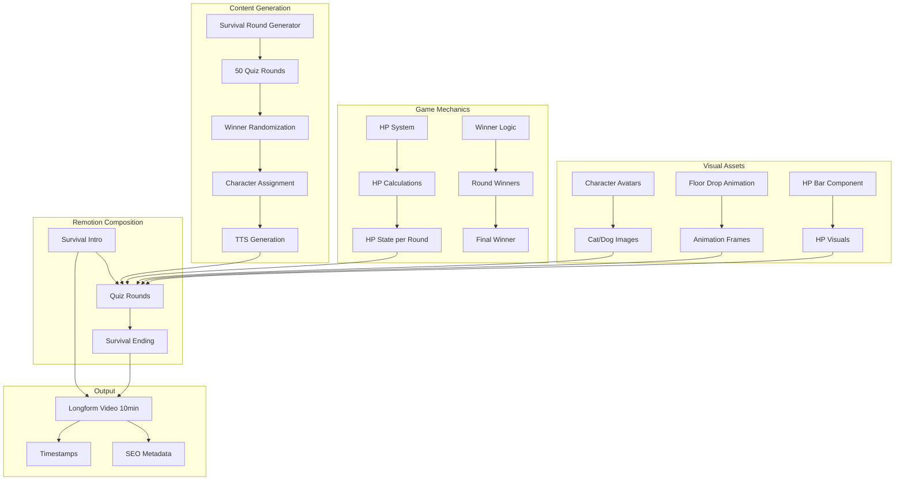

# Design Document: Survival Quiz Longform Video Generator

## Overview

"Cat vs Dog 50라운드 서바이벌" 게임쇼 형식의 롱폼 영어 학습 콘텐츠 자동 생성 시스템. 기존 비교형 콘텐츠 인프라를 확장하여 게임쇼 메카닉(HP, 서바이벌, 승자 결정)을 추가한다.

핵심 원칙:

- 빠른 템포 (8-10초/라운드) → 롱폼에서도 이탈 방지
- 랜덤 승자 결정 → "누가 이길까?" 예측 불가능성으로 끝까지 시청 유도
- HP 시스템 → 시각적 긴장감과 스테이크 제공
- 바닥 함락 애니메이션 → 오답의 결과를 강렬하게 전달

## Architecture



## Components and Interfaces

### 1. Survival Types (`src/survival/types.ts`)

```typescript
import { z } from 'zod';

// Character enum
export const survivalCharacterSchema = z.enum(['cat', 'dog']);
export type SurvivalCharacter = z.infer<typeof survivalCharacterSchema>;

// Character display info
export const CHARACTER_INFO: Record<
  SurvivalCharacter,
  {
    emoji: string;
    name: string;
    nameKorean: string;
    color: string;
  }
> = {
  cat: { emoji: '🐱', name: 'Cat', nameKorean: '고양이', color: '#FF9500' },
  dog: { emoji: '🐶', name: 'Dog', nameKorean: '강아지', color: '#5856D6' },
};

// Single quiz round
export const survivalRoundSchema = z.object({
  id: z.number().int().positive(),
  category: z.enum(['daily', 'business', 'emotion', 'request_reject', 'apology_thanks']),
  situation: z.string().min(1), // 상황 설명 (한국어)
  situationEnglish: z.string().min(1), // 상황 설명 (영어, 예: "Where is the bathroom?")
  konglishAnswer: z.object({
    text: z.string().min(1), // 한국인이 흔히 쓰는 표현
    character: survivalCharacterSchema, // 이 답변을 하는 캐릭터 (loser)
  }),
  nativeAnswer: z.object({
    text: z.string().min(1), // 원어민 표현
    character: survivalCharacterSchema, // 이 답변을 하는 캐릭터 (winner)
  }),
  explanation: z.string().min(1).max(30), // 간단 설명 (20자 이내 권장)
  winner: survivalCharacterSchema, // 이 라운드 승자
});

// HP state for a character
export const hpStateSchema = z.object({
  character: survivalCharacterSchema,
  currentHP: z.number().min(0).max(100),
  roundsLost: z.number().int().min(0),
});

// Complete survival script
export const survivalScriptSchema = z.object({
  channelId: z.string().min(1),
  date: z.string().regex(/^\d{4}-\d{2}-\d{2}$/),
  title: z.object({
    korean: z.string(), // "고양이 vs 강아지 50라운드 서바이벌"
    english: z.string(), // "Cat vs Dog 50-Round Survival"
  }),
  intro: z.object({
    title: z.string(), // "Cat vs Dog 서바이벌!"
    subtitle: z.string(), // "틀리면 바닥이 열립니다!"
  }),
  rounds: z.array(survivalRoundSchema).length(50),
  ending: z.object({
    winner: survivalCharacterSchema,
    catFinalHP: z.number().min(0).max(100),
    dogFinalHP: z.number().min(0).max(100),
    catWins: z.number().int().min(0).max(50),
    dogWins: z.number().int().min(0).max(50),
    ctaQuestion: z.string(), // "다음 대결에서는 누가 이길까요?"
  }),
});

export type SurvivalRound = z.infer<typeof survivalRoundSchema>;
export type HPState = z.infer<typeof hpStateSchema>;
export type SurvivalScript = z.infer<typeof survivalScriptSchema>;
```

### 2. HP System (`src/survival/hp-system.ts`)

```typescript
export interface HPSystemConfig {
  initialHP: number; // 100
  totalRounds: number; // 50
  minHPDecrease: number; // 최소 HP 감소량
  maxHPDecrease: number; // 최대 HP 감소량
}

export const DEFAULT_HP_CONFIG: HPSystemConfig = {
  initialHP: 100,
  totalRounds: 50,
  minHPDecrease: 2,
  maxHPDecrease: 5,
};

export class HPSystem {
  private catHP: number;
  private dogHP: number;
  private catLosses: number = 0;
  private dogLosses: number = 0;
  private config: HPSystemConfig;

  constructor(config: HPSystemConfig = DEFAULT_HP_CONFIG);

  // Calculate HP decrease for a round
  calculateHPDecrease(roundNumber: number, loserTotalLosses: number): number;

  // Apply round result
  applyRoundResult(
    loser: SurvivalCharacter,
    roundNumber: number
  ): {
    catHP: number;
    dogHP: number;
    hpDecrease: number;
  };

  // Get current HP state
  getHPState(): { cat: HPState; dog: HPState };

  // Get final results
  getFinalResults(): {
    winner: SurvivalCharacter;
    catFinalHP: number;
    dogFinalHP: number;
    catWins: number;
    dogWins: number;
  };
}
```

### 3. Winner Logic (`src/survival/winner-logic.ts`)

```typescript
export interface WinnerDecision {
  roundId: number;
  winner: SurvivalCharacter;
  loser: SurvivalCharacter;
}

/**
 * Pre-determine all 50 round winners using randomization
 * Ensures approximately 50/50 distribution with some variance
 */
export function generateRoundWinners(
  totalRounds: number = 50,
  seed?: number // Optional seed for reproducibility
): WinnerDecision[];

/**
 * Assign expressions to characters based on winner decision
 */
export function assignExpressionsToCharacters(
  konglishText: string,
  nativeText: string,
  winner: SurvivalCharacter
): {
  konglishAnswer: { text: string; character: SurvivalCharacter };
  nativeAnswer: { text: string; character: SurvivalCharacter };
};

/**
 * Calculate final winner based on round wins
 */
export function determineFinalWinner(roundWinners: WinnerDecision[]): SurvivalCharacter;
```

### 4. Survival Round Generator (`src/survival/generator.ts`)

```typescript
export interface SurvivalGeneratorConfig {
  roundCount: number; // 50
  categories?: ComparisonCategory[];
  excludeExpressions?: string[];
  seed?: number; // For reproducible randomization
}

export class SurvivalGenerator {
  private genAI: GoogleGenerativeAI;
  private hpSystem: HPSystem;

  constructor(apiKey: string);

  // Generate complete survival script
  async generateScript(
    channelId: string,
    config?: Partial<SurvivalGeneratorConfig>
  ): Promise<SurvivalScript>;

  // Generate raw expression pairs (before character assignment)
  private async generateExpressionPairs(
    count: number,
    config: SurvivalGeneratorConfig
  ): Promise<
    Array<{
      category: ComparisonCategory;
      situation: string;
      situationEnglish: string;
      konglishText: string;
      nativeText: string;
      explanation: string;
    }>
  >;
}
```

**Gemini 프롬프트 (빠른 템포용):**

```typescript
const SURVIVAL_PROMPT = `
You are creating content for a "Cat vs Dog English Survival Quiz" game show.

Generate ${count} English expression quiz pairs for rapid-fire rounds (8-10 seconds each).

Each pair should have:
1. category: one of [daily, business, emotion, request_reject, apology_thanks]
2. situation: 상황 설명 (Korean, VERY SHORT - under 15 characters)
3. situationEnglish: The English phrase being asked (e.g., "Where is the bathroom?")
4. konglishText: 한국인이 흔히 쓰는 어색한 영어 (Konglish/wrong)
5. nativeText: 원어민이 실제로 쓰는 표현 (correct)
6. explanation: 왜 다른지 설명 (Korean, UNDER 20 characters - must be very brief!)

CRITICAL RULES FOR FAST PACING:
- situation must be VERY SHORT (under 15 chars) - e.g., "화장실 어디에요?"
- explanation must be UNDER 20 chars - e.g., "toilet은 변기 자체를 의미"
- Focus on common, relatable mistakes
- Each pair must be instantly understandable

Examples:
{
  "category": "daily",
  "situation": "화장실 어디에요?",
  "situationEnglish": "Where is the bathroom?",
  "konglishText": "Where is toilet?",
  "nativeText": "Where is the restroom?",
  "explanation": "toilet은 변기 자체를 의미"
}

Return ONLY a JSON array (no markdown):
`;
```

### 5. Survival Timing Profile (`src/survival/timing.ts`)

```typescript
export interface SurvivalTimingConfig {
  situationDuration: number; // 1.5초
  dogAnswerDuration: number; // 1.5초
  catAnswerDuration: number; // 1.5초
  revealDelay: number; // 0.5초
  floorDropDuration: number; // 1.5초
  explanationDuration: number; // 1.5초
  transitionDuration: number; // 0.3초
}

export const DEFAULT_SURVIVAL_TIMING: SurvivalTimingConfig = {
  situationDuration: 1.5,
  dogAnswerDuration: 1.5,
  catAnswerDuration: 1.5,
  revealDelay: 0.5,
  floorDropDuration: 1.5,
  explanationDuration: 1.5,
  transitionDuration: 0.3,
};

// Total per round: 8.3초 (within 8-10초 target)

export function calculateRoundDuration(config: SurvivalTimingConfig): number;

export function calculateTotalVideoDuration(
  roundCount: number,
  introDuration: number,
  endingDuration: number,
  config: SurvivalTimingConfig
): number;
```

### 6. Visual Components

#### SurvivalIntro (`src/compositions/SurvivalIntro.tsx`)

```typescript
interface SurvivalIntroProps {
  title: string; // "Cat vs Dog 서바이벌!"
  subtitle: string; // "틀리면 바닥이 열립니다!"
  durationInFrames: number;
  style?: {
    backgroundColor: string;
    titleColor: string;
    catColor: string;
    dogColor: string;
  };
}

// Shows:
// - Game title with dramatic animation
// - Both characters side by side
// - HP bars at 100 for both
// - Rules text
```

#### HPBar (`src/compositions/HPBar.tsx`)

```typescript
interface HPBarProps {
  character: SurvivalCharacter;
  currentHP: number;
  maxHP: number;
  previousHP?: number; // For animation
  position: 'left' | 'right';
  style?: {
    barColor: string;
    backgroundColor: string;
    damageColor: string;
  };
}

// Features:
// - Smooth HP decrease animation
// - Damage flash effect
// - Character emoji/avatar
// - HP number display
```

#### FloorDrop (`src/compositions/FloorDrop.tsx`)

```typescript
interface FloorDropProps {
  character: SurvivalCharacter;
  durationInFrames: number;
  onComplete?: () => void;
  style?: {
    floorColor: string;
    backgroundColor: string;
  };
}

// Animation sequence:
// 1. Floor panels start shaking
// 2. Floor opens (splits in middle)
// 3. Character falls through
// 4. Floor closes
```

#### RoundCounter (`src/compositions/RoundCounter.tsx`)

```typescript
interface RoundCounterProps {
  currentRound: number;
  totalRounds: number;
  isFinalStretch?: boolean; // Rounds 45-50
  style?: {
    textColor: string;
    accentColor: string;
  };
}

// Shows: "Round 15/50"
// Final stretch: adds glow/pulse effect
```

#### SurvivalRoundView (`src/compositions/SurvivalRoundView.tsx`)

```typescript
interface SurvivalRoundViewProps {
  round: SurvivalRound;
  roundNumber: number;
  catHP: number;
  dogHP: number;
  previousCatHP: number;
  previousDogHP: number;
  audioFiles?: {
    situation?: string;
    dogAnswer?: string;
    catAnswer?: string;
    floorDrop?: string;
    hpDecrease?: string;
    explanation?: string;
  };
  timingConfig?: SurvivalTimingConfig;
}

// Renders complete round:
// 1. Situation display
// 2. Dog answer (with character)
// 3. Cat answer (with character)
// 4. 0.5s delay
// 5. Floor drop for loser
// 6. HP decrease animation
// 7. Brief explanation
```

#### SurvivalEnding (`src/compositions/SurvivalEnding.tsx`)

```typescript
interface SurvivalEndingProps {
  winner: SurvivalCharacter;
  catFinalHP: number;
  dogFinalHP: number;
  catWins: number;
  dogWins: number;
  ctaQuestion: string;
  durationInFrames: number;
  channelLogo?: string;
}

// Shows:
// - Winner announcement with celebration
// - Final HP bars
// - Score: "Cat 23승 vs Dog 27승"
// - CTA question
// - Subscribe reminder
```

#### SurvivalLongform (`src/compositions/SurvivalLongform.tsx`)

```typescript
interface SurvivalLongformProps {
  script: SurvivalScript;
  audioFiles?: SurvivalAudioFiles;
  backgroundImage?: string;
  channelLogo?: string;
  timingConfig?: SurvivalTimingConfig;
}

// Main composition structure:
// [0:00-0:08] Survival Intro
// [0:08-8:30] 50 Quiz Rounds (8.3초 each)
// [8:30-8:45] Survival Ending
// Total: ~8:45 (within 8-12 min target)
```

### 7. Audio Generation (`src/survival/audio.ts`)

```typescript
interface SurvivalAudioConfig {
  situationVoice: string; // Korean TTS
  catVoice: string; // English TTS (character-specific)
  dogVoice: string; // English TTS (character-specific)
  explanationVoice: string; // Korean TTS
}

interface SurvivalAudioFiles {
  intro?: string;
  rounds: Array<{
    situation?: string;
    dogAnswer?: string;
    catAnswer?: string;
    explanation?: string;
  }>;
  ending?: string;
  sfx: {
    floorDrop: string;
    hpDecrease: string;
    victory: string;
    roundStart: string;
  };
}

async function generateSurvivalAudio(
  script: SurvivalScript,
  config: SurvivalAudioConfig,
  outputDir: string
): Promise<SurvivalAudioFiles>;
```

### 8. Pipeline (`src/survival/pipeline.ts`)

```typescript
interface SurvivalPipelineOptions {
  channelId: string;
  roundCount?: number; // default: 50
  categories?: ComparisonCategory[];
  outputDir?: string;
  autoRender?: boolean;
  seed?: number; // For reproducible results
}

interface SurvivalPipelineResult {
  success: boolean;
  script: SurvivalScript;
  audioFiles: SurvivalAudioFiles;
  videoPath?: string;
  timestamps: string[];
  seoMetadata: SEOMetadata;
}

async function runSurvivalPipeline(
  options: SurvivalPipelineOptions
): Promise<SurvivalPipelineResult>;
```

## Data Models

### Round Flow Structure

```
[Round N: 8.3초]
├── Phase 1 (1.5초): Situation
│   ├── "화장실 어디에요?"
│   └── Round counter: "Round N/50"
├── Phase 2 (1.5초): Dog Answer
│   ├── 🐶 "Where is toilet?"
│   └── HP bars visible
├── Phase 3 (1.5초): Cat Answer
│   ├── 🐱 "Where is the restroom?"
│   └── HP bars visible
├── Phase 4 (0.5초): Reveal Delay
│   └── Tension build-up
├── Phase 5 (1.5초): Floor Drop
│   ├── Loser falls through floor
│   ├── HP decrease animation
│   └── Sound effects
└── Phase 6 (1.5초): Explanation
    └── "toilet은 변기 자체를 의미"

[Transition: 0.3초]
```

### HP Calculation Logic

```typescript
// HP decreases are calculated to ensure:
// 1. Loser reaches near 0 HP by round 50
// 2. Winner maintains some HP
// 3. Variance in decrease amounts for drama

function calculateHPDecrease(
  roundNumber: number,
  loserTotalLosses: number,
  totalRounds: number = 50
): number {
  // Base decrease: 100 HP / ~25 losses = ~4 HP per loss
  // Add variance: 2-5 HP per loss
  const baseDecrease = 100 / (totalRounds / 2);
  const variance = Math.random() * 2 - 1; // -1 to +1
  return Math.max(2, Math.min(5, Math.round(baseDecrease + variance)));
}
```

### Video Duration Calculation

```typescript
const TIMING = {
  introDuration: 8, // seconds
  roundDuration: 8.3, // seconds per round
  transitionDuration: 0.3, // seconds between rounds
  endingDuration: 15, // seconds
};

// 50 rounds:
// Intro: 8초
// Rounds: 50 * 8.3초 = 415초 (6분 55초)
// Transitions: 49 * 0.3초 = 14.7초
// Ending: 15초
// Total: 452.7초 ≈ 7분 33초

// To reach 10 minutes, can:
// - Increase round duration to 10초 → 500초 + 8 + 14.7 + 15 = 537.7초 ≈ 9분
// - Add more dramatic pauses
// - Extend intro/ending
```

## Error Handling

| Error Type               | Condition                    | Handling                       |
| ------------------------ | ---------------------------- | ------------------------------ |
| InsufficientRoundsError  | Generated < 50 rounds        | Regenerate with explicit count |
| DuplicateExpressionError | Expression in recent history | Regenerate with exclusion list |
| DurationOutOfBoundsError | Video < 8min or > 12min      | Adjust timing config           |
| HPCalculationError       | HP goes negative             | Clamp to 0                     |
| TTSGenerationError       | TTS API failure              | Retry 3 times, then skip       |
| RenderTimeoutError       | Remotion timeout             | Reduce quality, retry          |
| InvalidWinnerError       | Winner count mismatch        | Recalculate from rounds        |

## Correctness Properties

_A property is a characteristic or behavior that should hold true across all valid executions of a system—essentially, a formal statement about what the system should do. Properties serve as the bridge between human-readable specifications and machine-verifiable correctness guarantees._

### Property 1: Round Count Exactness

_For any_ generated SurvivalScript, the rounds array length SHALL be exactly 50.

**Validates: Requirements 1.1**

### Property 2: Round Structure Completeness

_For any_ SurvivalRound in a generated script, it SHALL contain non-empty values for: situation, situationEnglish, konglishAnswer.text, konglishAnswer.character, nativeAnswer.text, nativeAnswer.character, explanation, and winner.

**Validates: Requirements 1.2, 4.4**

### Property 3: Round Duration Bounds

_For any_ timing configuration, the calculated round duration (sum of all phases) SHALL be between 8 and 10 seconds.

**Validates: Requirements 1.3, 6.1**

### Property 4: Category Distribution

_For any_ generated SurvivalScript with 50 rounds, no single category SHALL represent more than 50% of total rounds (max 25 rounds per category).

**Validates: Requirements 1.4, 12.3**

### Property 5: Character Enum Validity

_For any_ character field in a SurvivalRound (konglishAnswer.character, nativeAnswer.character, winner), the value SHALL be either 'cat' or 'dog'.

**Validates: Requirements 2.1**

### Property 6: HP Initialization

_For any_ newly created HPSystem instance, both cat and dog HP SHALL be initialized to exactly 100.

**Validates: Requirements 3.1**

### Property 7: HP Decrease on Loss

_For any_ round result applied to HPSystem where a character loses, that character's HP SHALL decrease by a positive amount, and the winner's HP SHALL remain unchanged.

**Validates: Requirements 3.2, 3.4**

### Property 8: HP Non-Negative Invariant

_For any_ sequence of round results applied to HPSystem, both cat and dog HP SHALL always be >= 0.

**Validates: Requirements 3.6**

### Property 9: Winner Randomization Distribution

_For any_ large sample of generated winner sequences (1000+ rounds), the distribution of cat vs dog wins SHALL be approximately 50/50 (within 45-55% range).

**Validates: Requirements 4.1**

### Property 10: Answer Assignment Correctness

_For any_ SurvivalRound, the loser character (opposite of winner) SHALL have the konglishAnswer, and the winner character SHALL have the nativeAnswer.

**Validates: Requirements 4.2**

### Property 11: Win Tracking Sum

_For any_ completed SurvivalScript, catWins + dogWins SHALL equal exactly 50 (total rounds).

**Validates: Requirements 4.3**

### Property 12: Final Winner Determination

_For any_ SurvivalScript ending, the winner field SHALL match the character with more round wins (catWins > dogWins → cat wins, dogWins > catWins → dog wins).

**Validates: Requirements 4.5**

### Property 13: Video Duration Bounds

_For any_ generated video with 50 rounds, the total duration SHALL be between 8 and 12 minutes.

**Validates: Requirements 6.3, 6.4**

### Property 14: Intro Duration Bounds

_For any_ SurvivalIntro configuration, the duration SHALL be between 5 and 8 seconds.

**Validates: Requirements 7.4**

### Property 15: Ending Duration Bounds

_For any_ SurvivalEnding configuration, the duration SHALL be between 10 and 15 seconds.

**Validates: Requirements 8.5**

### Property 16: Round Counter Format

_For any_ round number N (1-50), the formatted round counter SHALL match the pattern "Round N/50".

**Validates: Requirements 9.2**

### Property 17: Explanation Length

_For any_ SurvivalRound explanation, the character count SHALL be under 30 characters (with 20 recommended).

**Validates: Requirements 10.2**

### Property 18: Expression Uniqueness in Batch

_For any_ generated SurvivalScript, all konglishAnswer.text values SHALL be unique within the script, and all nativeAnswer.text values SHALL be unique within the script.

**Validates: Requirements 12.5**

### Property 19: Expression Recency Exclusion

_For any_ newly generated expression, it SHALL NOT appear in expressions used in the last 10 videos (when database is available).

**Validates: Requirements 12.2**

### Property 20: Expression Blacklist Exclusion

_For any_ generated expression, it SHALL NOT match any expression in the blacklist.

**Validates: Requirements 12.4**

### Property 21: Forbidden Pattern Detection

_For any_ expression matching forbidden patterns (overly textbook-like), the Linguistic_Validator SHALL return a failed validation status.

**Validates: Requirements 13.1, 13.2**

### Property 22: Confidence Score Presence

_For any_ expression validated by Linguistic_Validator, the result SHALL include a confidence score between 0 and 1.

**Validates: Requirements 13.4**

### Property 23: Timestamp Completeness

_For any_ generated video, timestamps SHALL include: intro marker, round markers at 1/10/20/30/40/50, and ending marker.

**Validates: Requirements 14.1, 14.2, 14.3**

### Property 24: Timestamp Format

_For any_ generated timestamp, it SHALL match the YouTube chapter format pattern: "M:SS Label" or "MM:SS Label".

**Validates: Requirements 14.4**

## Testing Strategy

### Dual Testing Approach

This feature requires both unit tests and property-based tests for comprehensive coverage:

- **Unit tests**: Verify specific examples, edge cases, and error conditions
- **Property tests**: Verify universal properties across all inputs using randomized testing

### Property-Based Testing Configuration

- **Library**: fast-check (TypeScript property-based testing library)
- **Minimum iterations**: 100 per property test
- **Tag format**: `Feature: survival-quiz-longform, Property {number}: {property_text}`

### Unit Test Focus Areas

1. **HP System Edge Cases**
   - HP at exactly 0 after many losses
   - HP decrease calculation at round 1 vs round 50
   - Tie-breaking when both characters have equal wins

2. **Winner Logic Edge Cases**
   - Seed reproducibility
   - Edge case: 25-25 tie (should still determine winner)

3. **Timing Calculation**
   - Boundary conditions (exactly 8 seconds, exactly 10 seconds)
   - Custom timing profile validation

4. **Expression Generation**
   - Empty exclusion list
   - Full blacklist scenario
   - Category filtering

### Property Test Implementation Examples

```typescript
import fc from 'fast-check';

// Property 1: Round Count Exactness
// Feature: survival-quiz-longform, Property 1: Round count exactly 50
fc.assert(
  fc.property(fc.constant(null), async () => {
    const script = await generator.generateScript('test-channel');
    return script.rounds.length === 50;
  }),
  { numRuns: 100 }
);

// Property 8: HP Non-Negative Invariant
// Feature: survival-quiz-longform, Property 8: HP non-negative invariant
fc.assert(
  fc.property(
    fc.array(fc.constantFrom('cat', 'dog'), { minLength: 1, maxLength: 50 }),
    (losers) => {
      const hpSystem = new HPSystem();
      for (let i = 0; i < losers.length; i++) {
        hpSystem.applyRoundResult(losers[i], i + 1);
      }
      const state = hpSystem.getHPState();
      return state.cat.currentHP >= 0 && state.dog.currentHP >= 0;
    }
  ),
  { numRuns: 100 }
);

// Property 10: Answer Assignment Correctness
// Feature: survival-quiz-longform, Property 10: Answer assignment correctness
fc.assert(
  fc.property(
    fc.constantFrom('cat', 'dog'),
    fc.string({ minLength: 1 }),
    fc.string({ minLength: 1 }),
    (winner, konglish, native) => {
      const result = assignExpressionsToCharacters(konglish, native, winner);
      const loser = winner === 'cat' ? 'dog' : 'cat';
      return result.konglishAnswer.character === loser && result.nativeAnswer.character === winner;
    }
  ),
  { numRuns: 100 }
);

// Property 24: Timestamp Format
// Feature: survival-quiz-longform, Property 24: Timestamp format
fc.assert(
  fc.property(
    fc.integer({ min: 0, max: 720 }), // 0-12 minutes in seconds
    fc.string({ minLength: 1, maxLength: 20 }),
    (seconds, label) => {
      const timestamp = formatTimestamp(seconds, label);
      return /^\d{1,2}:\d{2} .+$/.test(timestamp);
    }
  ),
  { numRuns: 100 }
);
```

### Integration Test Scenarios

1. **Full Pipeline Test**
   - Generate script → Validate → Generate audio → Render video
   - Verify output files exist and are valid

2. **Expression Database Integration**
   - Generate multiple scripts
   - Verify no expression repetition across scripts

3. **Remotion Composition Test**
   - Render sample frames at key points
   - Verify HP bars, round counter, character positions

### Test File Organization

```
src/survival/
├── __tests__/
│   ├── hp-system.test.ts          # Unit tests for HP system
│   ├── hp-system.property.test.ts # Property tests for HP system
│   ├── winner-logic.test.ts       # Unit tests for winner logic
│   ├── winner-logic.property.test.ts # Property tests for winner logic
│   ├── generator.test.ts          # Unit tests for generator
│   ├── generator.property.test.ts # Property tests for generator
│   ├── timing.test.ts             # Unit tests for timing
│   └── timing.property.test.ts    # Property tests for timing
```
